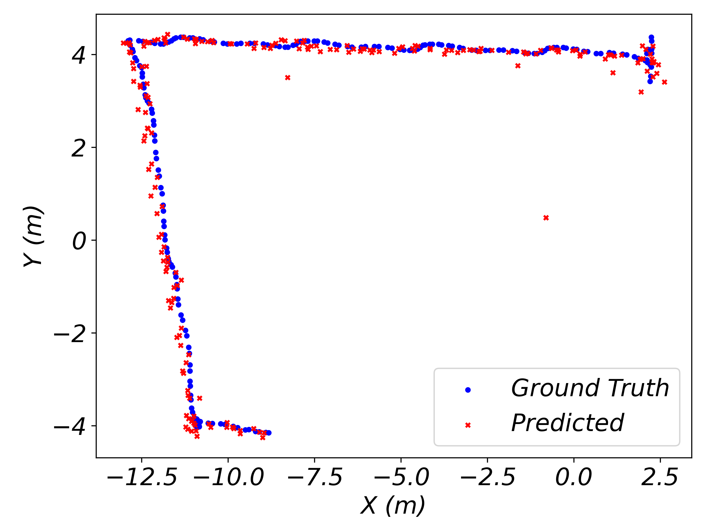

# DT-positioning
## Getting Start
### 1 Intsall Unreal Engine 4
1. Download and Install the UnrealEngine Launcher.
2. Open Unreal Engine Launcher and install UnrealEngine (>=4.26.2)
### 2 Run Simulator
1. Open DT Positioning.uproject file

2. Rebuild the project. 

3. Click Build button to build the project

4. Click Play button to run the simulator
### 3 Simulation details
1. You can use WADS and mouse to move the human object freely. 
2. Press tab to switch between the player mode and the God mode.
   

### 4 Localization
1. Run ev.py in Source/DTPositioningpy to get the localization results

### 5 Acknowledgement
We used the simulation system from paper: "Zhongzheng Lai, Dong Yuan, Wei Bao, Yu Zhang, and Bing Bing Zhou. 2022. DeepWiSim: a wireless signal simulator for automatic deep learning. In Proceedings of the SIGCOMM '22 Poster and Demo Sessions (SIGCOMM '22). Association for Computing Machinery, New York, NY, USA, 13–15. https://doi.org/10.1145/3546037.3546049"
