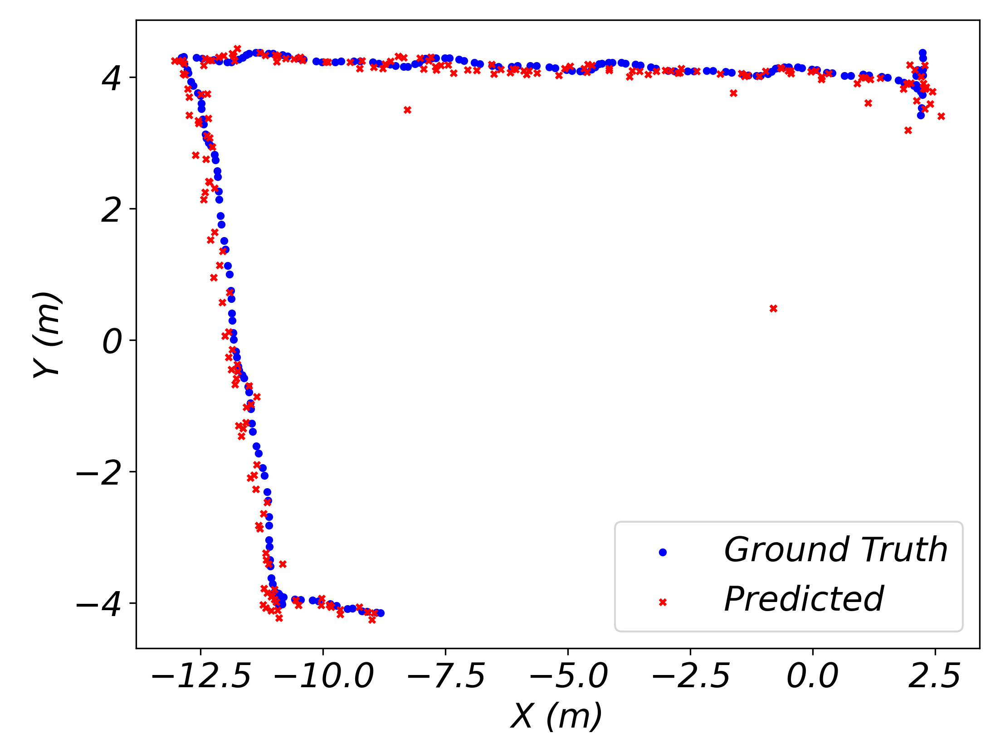

# DT-positioning

A digital-twin platform to simulate UE movement and perform localization.

## Getting Start

### Install UE4

1. [Download](https://www.unrealengine.com/en-US/download) and Install the UnrealEngine Launcher.
2. Open Unreal Engine Launcher and install UnrealEngine (>=4.26.2)

### Run Simulator

1. Open DT positioning.uproject file

2. Click Build button to rebuild the project

3. Click Play button to run the simulator

### Simulator Settings

You can open the settings menu to change parameters.

- `Frequency (GHz)`, control the frequency of the simulated wireless signal. It is set to 2.45 GHz by default as simulating Bluetooth beacon signal.
- `Transmit Power (dBm)`, control the transmit power of the beacon
- `DPI`, control the resolution of wireless sensor, increase DPI will increase the number of rays for simulating signal propagation.
- `Ray-trace Distance (cm)`, controls how far the ray can reach.
- `Ray-trace Depth (cm)`, controls the number of times the ray can be reflected.

### Localization

  run ev.py in Source/DTpositioingpy to reproduce the result.
  

### Acknowledge 

1. Ref: DeepWiSim: a wireless signal simulator for automatic deep learning. In Proceedings of the SIGCOMM '22 Poster and Demo Sessions (SIGCOMM '22).
2. NICE Lab, NCSU

